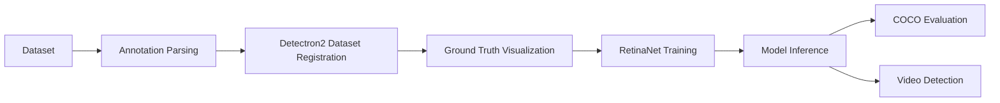

# 🚘 Vehicle License Plate Detection using Detectron2


A computer vision project for detecting vehicle license plates in images and video frames using **Detectron2**, **RetinaNet**, **PyTorch**, and **OpenCV**.

This project started as an object detection exercise and was redesigned as a clean, professional machine-learning portfolio project. The goal is to build a practical detection pipeline that can identify vehicle registration plates from real-world images and video.

---

## 📌 Project Summary

License plate detection is an important part of many intelligent transportation and security systems, including parking management, traffic monitoring, automated access control, and smart surveillance.

In this project, I fine-tuned a **COCO-pretrained RetinaNet model** using Detectron2 to detect one custom object class:

> `vehicle-registration-plate`

The project includes dataset preparation, annotation parsing, dataset registration, training, inference, evaluation, and video-based detection.

---

## ✨ Key Features

- ✅ Custom dataset registration in Detectron2 format  
- ✅ Ground-truth bounding box visualization  
- ✅ RetinaNet object detector with ResNet-50 FPN backbone  
- ✅ Fine-tuning from COCO-pretrained weights  
- ✅ Image-based license plate inference  
- ✅ Video-frame license plate detection  
- ✅ COCO-style evaluation using AP metrics  
- ✅ Clean notebook workflow for training and experimentation  
- ✅ Portfolio-ready project structure for GitHub  

---

## 🧠 Model Architecture

The project uses **RetinaNet**, a one-stage object detection model designed for efficient and accurate object detection.

| Component | Description |
|---|---|
| Framework | Detectron2 |
| Deep Learning Backend | PyTorch |
| Model | RetinaNet |
| Backbone | ResNet-50 FPN |
| Pretrained Weights | COCO Detection |
| Target Class | Vehicle Registration Plate |
| Evaluation | COCO Detection Metrics |

---

## 🗂️ Dataset

The dataset contains vehicle images and bounding box annotations for vehicle registration plates.

Expected dataset structure:

```text
Dataset/
├── train/
│   └── Vehicle registration plate/
│       └── Label/
└── validation/
    └── Vehicle registration plate/
        └── Label/
```

Each image has an associated annotation file containing the license plate bounding box coordinates.

---

## 🔄 Project Workflow



---

## 📸 Sample Results

> Add your own output images inside the `assets/` folder and keep the same file names used below.

### Ground Truth Annotation

This image shows the original dataset annotation with the license plate bounding box.


---

### Model Prediction

This image shows the trained model detecting a license plate.

![Prediction Sample]


---

### Video Detection Preview

https://github.com/user-attachments/assets/bf20692d-224a-4c55-86ec-feea72881d34))](https://github.com/user-attachments/assets/bf20692d-224a-4c55-86ec-feea72881d34

---

## 📊 Evaluation

The model is evaluated using COCO-style detection metrics.

Important metrics include:

| Metric | Meaning |
|---|---|
| AP | Average Precision across IoU thresholds |
| AP50 | Average Precision at IoU = 0.50 |
| AP75 | Average Precision at IoU = 0.75 |
| APs / APm / APl | Performance for small, medium, and large objects |

Example result format:

```text
Average Precision  (AP) @[ IoU=0.50:0.95 ] = ...
Average Precision  (AP50) @[ IoU=0.50 ] = ...
Average Precision  (AP75) @[ IoU=0.75 ] = ...
```

> Replace this section with your final evaluation results after running the cleaned notebook.

---

## 🛠️ Technologies Used

| Tool | Purpose |
|---|---|
| Python | Main programming language |
| PyTorch | Deep learning framework |
| Detectron2 | Object detection framework |
| RetinaNet | Detection model |
| OpenCV | Image and video processing |
| NumPy | Numerical operations |
| Matplotlib | Visualization |
| COCOEvaluator | Model evaluation |

---

## 🚀 Getting Started

### 1. Clone the Repository

```bash
git clone https://github.com/YOUR_USERNAME/license-plate-detection-detectron2.git
cd license-plate-detection-detectron2
```

### 2. Create a Virtual Environment

```bash
python -m venv venv
```

Activate it:

```bash
# Windows
venv\Scripts\activate

# macOS / Linux
source venv/bin/activate
```

### 3. Install Dependencies

```bash
pip install -r requirements.txt
```

Detectron2 installation may depend on your CUDA, PyTorch, and Python version. If the normal installation does not work, install Detectron2 from source:

```bash
python -m pip install 'git+https://github.com/facebookresearch/detectron2.git'
```

### 4. Run the Notebook

Open the notebook:

```text
notebooks/license_plate_detection.ipynb
```

Then run the workflow step by step:

1. Download and prepare the dataset  
2. Register training and validation datasets  
3. Visualize ground-truth bounding boxes  
4. Configure the RetinaNet model  
5. Train the model  
6. Run inference on validation images  
7. Evaluate with COCO metrics  
8. Run detection on video frames  

---

## 📁 Recommended Project Structure

```text
license-plate-detection-detectron2/
│
├── README.md
├── requirements.txt
├── .gitignore
├── LICENSE
│
├── notebooks/
│   └── license_plate_detection.ipynb
│
├── assets/
│   ├── ground_truth_sample.jpg
│   ├── prediction_sample.jpg
│   └── video_demo.gif
│
├── results/
│   └── evaluation_results.txt
│
└── src/
    ├── dataset.py
    ├── train.py
    ├── inference.py
    └── evaluate.py
```

For the first version of the repository, the notebook and README are enough. Later, the code can be moved into the `src/` folder to make the project more production-style.

---

## ⚙️ Configuration Notes

The model configuration is based on:

```python
COCO-Detection/retinanet_R_50_FPN_3x.yaml
```

Important configuration values:

```python
cfg.MODEL.RETINANET.NUM_CLASSES = 1
cfg.SOLVER.IMS_PER_BATCH = 4
cfg.SOLVER.BASE_LR = 0.0005
cfg.MODEL.RETINANET.SCORE_THRESH_TEST = 0.5
```

Recommended dataset setup:

```python
cfg.DATASETS.TRAIN = ("vrp_train",)
cfg.DATASETS.TEST = ("vrp_val",)
```

---

## 🧪 Inference Example

After training, the model can be used to detect license plates in validation images:

```python
cfg.MODEL.WEIGHTS = os.path.join(cfg.OUTPUT_DIR, "model_final.pth")
cfg.MODEL.RETINANET.SCORE_THRESH_TEST = 0.5

predictor = DefaultPredictor(cfg)
outputs = predictor(image)
```

Predicted bounding boxes can then be visualized using Detectron2's `Visualizer`.

---

## 🎥 Video Detection

The trained model can also be applied frame by frame on a video file.

General process:

```text
Input Video → Read Frame → Run Detector → Draw Bounding Box → Save Output Video
```

This makes the project more practical and closer to a real-world computer vision application.

---

## 🔮 Future Improvements

Planned improvements for making this project more advanced:

- Add OCR to read the detected license plate text  
- Deploy the detection model using FastAPI  
- Add real-time webcam detection  
- Convert notebook code into reusable Python scripts  
- Add Docker support for easier setup  
- Track experiments using TensorBoard or MLflow  
- Improve performance with a larger and more diverse dataset  
- Export the model for optimized inference  
- Add a simple web interface for uploading images and viewing predictions  

---

## 💼 Portfolio Value

This project demonstrates practical experience with:

- Deep learning-based object detection  
- Custom dataset preparation  
- Transfer learning  
- Computer vision model training  
- Model evaluation using industry-standard metrics  
- Image and video inference pipelines  
- Python-based AI project development  

This makes it suitable for showcasing computer vision and machine-learning skills in a GitHub portfolio.

---

## 👨‍💻 Author

**Hesam**  
Software Developer | Computer Vision & AI Enthusiast

---

## 📄 License

This project is available under the MIT License.

---

## 🙌 Acknowledgment

This project uses Detectron2, PyTorch, OpenCV, and COCO-style evaluation tools. The project has been cleaned and structured as a professional portfolio project for learning, demonstration, and future development.
